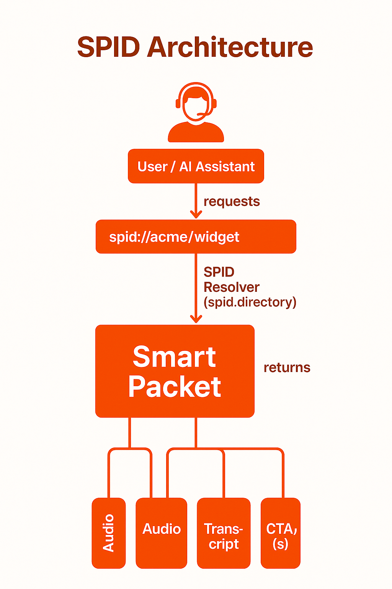

# 🧭 SPID Protocol Overview

The **SPID Protocol** is the new open standard for routing, resolving, and retrieving voice-first content on the AI-powered internet.

Instead of scraping outdated web pages, AI systems can now resolve a `spid://` to retrieve a fully structured, human-approved **Smart Packet** — complete with transcript, intent, and call-to-action.

---

## 🎯 What SPID Enables

* **AI assistants** can directly access structured answers
* **Users** receive interactive voice content with actionable outcomes
* **Businesses** can be found, heard, and trusted — without cold calls or SEO games

---

## 📦 Smart Packet Structure

Each Smart Packet includes:

* A **transcript** (plain text content)
* An **audio voice message** (pre-recorded or TTS)
* **Intent metadata** (what the message is about)
* **CTA(s)** — next-step actions (e.g. book, share, follow-up)

---

## 🧱 Protocol Components

| Component          | Description                                         |
| ------------------ | --------------------------------------------------- |
| **SPID**           | Unique identifier (e.g. `spid://acme/widget123`)    |
| **SPID Directory** | Central resolver for looking up SPID → Smart Packet |
| **PulseID**        | Inbox + routing system for async voice messages     |
| **Viewer Tools**   | UI/SDK for playing Smart Packets + rendering CTAs   |

---

## 📊 Architecture Diagram

Below is a visual overview of how SPID works from request to resolution:

---

## 🔗 Explore More

* [Smart Packet Spec](../smartpacket-spec)
* [Submit an RFC](../rfc)
* [Terms of Use](../TERMS.md)

Have questions? [hello@voicemate.id](mailto:hello@voicemate.id)
